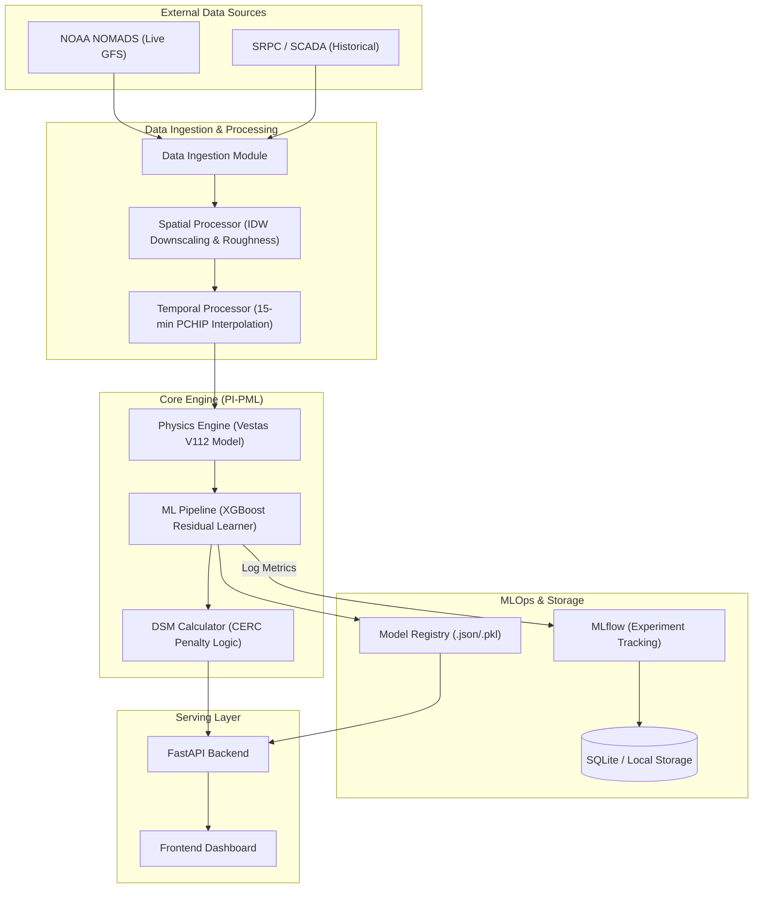
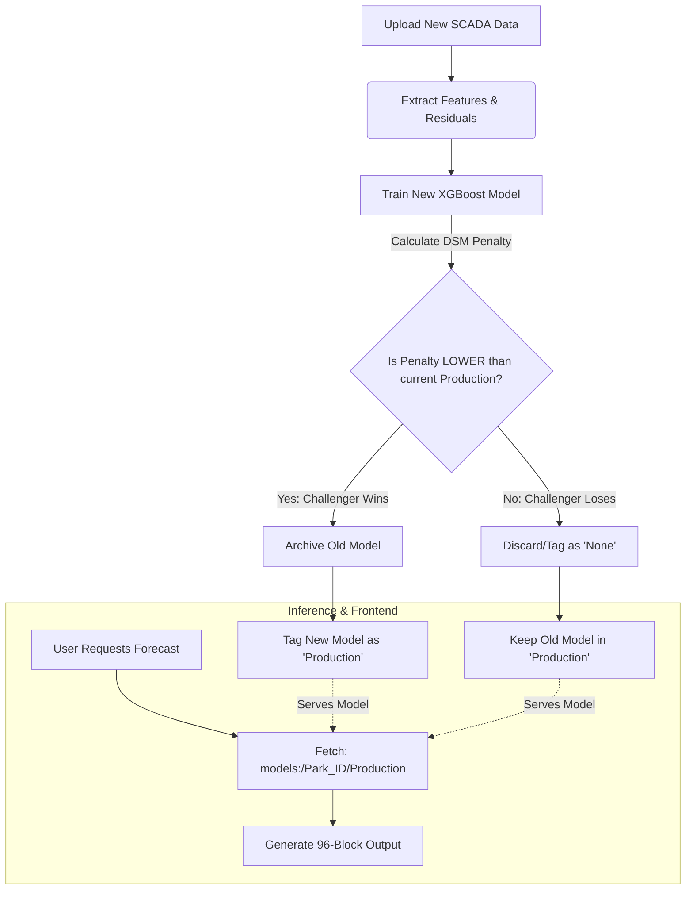

# Wind DSM Optimization: Physics-Informed Predictive Machine Learning (PI-PML)

[](https://www.python.org/)
[](https://fastapi.tiangolo.com/)
[](https://mlflow.org/)
[](https://xgboost.readthedocs.io/)
[](https://opensource.org/licenses/MIT)

This project implements a state-of-the-art **Double-Engine Forecasting Pipeline (PI-PML)** designed to minimize grid deviation penalties for wind power plant operators in India under the **CERC (Central Electricity Regulatory Commission) Deviation Settlement Mechanism (DSM)**. 

By combining **deterministic turbine physics** with a **stochastic machine learning (XGBoost) model** that predicts structural residuals, the system achieves significant accuracy improvements and cost savings over pure physics baselines.

---

## 📖 Table of Contents
1. [High-Level Architecture](#-high-level-architecture)
2. [Core Intelligence (PI-PML Engine)](#-core-intelligence-pi-pml-engine)
3. [Regulatory & DSM Calculator](#-regulatory--dsm-calculator)
4. [Real-World Validation (RSOPL Koppal)](#-real-world-validation-rsopl-koppal)
5. [Interactive Web Dashboard](#-interactive-web-dashboard)
6. [MLOps & Model Lifecycle (MLflow)](#-mlops--model-lifecycle-mlflow)
7. [📂 Codebase Structure](#-codebase-structure)
8. [🚀 Installation & Setup](#-installation--setup)
9. [⚙️ How to Run](#-how-to-run)
10. [🐳 Containerized Deployment (Docker)](#-containerized-deployment-docker)
11. [📡 API Endpoints](#-api-endpoints)

---

## 🗺️ High-Level Architecture

The system coordinates NOAA live weather GFS APIs, spatial/temporal downscaling, turbine aerodynamics, residual XGBoost regressors, and MLflow tracking, before exposing results to a FastAPI server and Leaflet.js interactive map dashboard.



*For more details on the architecture, read the [Architecture Blueprint](file:///c:/Users/tb619/Videos/Team%20Liquid/valo/architecture_blueprint.md).*

---

## 🧠 Core Intelligence (PI-PML Engine)

Rather than predicting total wind generation from scratch, the pipeline uses a **Physics-Informed Predictive Machine Learning (PI-PML)** approach:
1. **The Physics Baseline**: Models the deterministic power output of a turbine (Default: **3MW Vestas V112**) using [windpowerlib](https://github.com/windpowerlib/windpowerlib).
2. **The Residual ML Learner**: Trains an **XGBoost Regressor** to predict the *error* (residual) of the physics engine, correcting it for local atmospheric dynamics, terrain, and diurnal patterns.

### Spatial Downscaling & Terrain Processing
* **Bilinear Spline downscaling** maps 25km GFS grids to a precise 1km target coordinate.
* **Logarithmic Wind Profile correction** scales wind speeds to hub height using high-resolution local surface roughness ($z_0$).
* **Elevation Speedup correction** models wind speed increases due to topographical compression (e.g., hill ridges on the Deccan Plateau).

### Temporal Interpolation (96-Block Standards)
* To meet the Indian grid's **15-minute block scheduling** requirements, hourly weather forecasts are interpolated down using **PCHIP** (Piecewise Cubic Hermite Interpolating Polynomial).
* Unlike linear or standard cubic splines, PCHIP guarantees smooth curvature tracking momentum *without* causing non-physical overshoots or undershoots.

### Micro-Physics Aerodynamics
* **Moist Air Density Calculations**: Rather than assuming dry air, density is calculated using partial pressures of dry air and water vapor (Tetens equation). This is critical for coastal salt-marsh regions like **Khavda** where air is less dense.
* **DFIG Efficiency Losses**: Simulates copper and iron electrical losses in a Doubly-Fed Induction Generator, applying varying efficiency penalties at lower wind speeds ($< 6\text{ m/s}$).

---

## 📊 Regulatory & DSM Calculator

The financial engine applies the **Indian CERC DSM (Deviation Settlement Mechanism)** regulations to evaluate penalties. It supports three distinct regulatory zones:

| Zone | Tolerance Band | Denominator | Penalty Structure |
| :--- | :--- | :--- | :--- |
| **Zone 1** (Tight - e.g., Tamil Nadu) | **10%** | Available Capacity (AvC) | 10–20%: ₹0.50/unit <br> 20–30%: ₹1.00/unit <br> >30%: ₹1.50/unit |
| **Zone 2** (Standard - e.g., MH, RJ, GJ) | **15%** | Available Capacity (AvC) | 15–25%: ₹0.50/unit <br> 25–35%: ₹1.00/unit <br> >35%: ₹1.50/unit |
| **Zone 3** (Market Linked - e.g., Khavda) | **10%** | Scheduled Generation | >10%: **10% of PPA Rate** per unit of deviation |

### Dynamic ACP Pricing Multipliers
To simulate real grid spot-market conditions, the calculator features time-of-day multipliers:
* **Morning Peak** (06:00 - 09:00): **1.5x**
* **Evening Peak** (18:00 - 22:00): **2.5x**
* **Night/Off-Peak** (00:00 - 05:00): **0.8x**
* **Normal**: **1.0x**

---

## 📈 Real-World Validation (RSOPL Koppal)

The pipeline was validated using official 15-minute block grid dispatch data for the **75 MW RSOPL Koppal** wind plant in Karnataka, obtained from the Southern Regional Power Committee (SRPC), covering 29,568 blocks over 10 continuous months.

### Experimental Results (Out-of-Sample 2-Month Test Set)
* **Error Reduction (MAE)**: Reduced absolute forecasting error by **71.2%**
* **Original Baseline Penalty**: **₹ 24,83,254**
* **ML Optimized Penalty**: **₹ 1,29,282**
* **Evaluated Net Savings**: **₹ 23,53,972 (approx. ₹ 23.5 Lakhs)**
* **Projected Annual Savings**: **₹ 1,41,23,833 (~₹ 1.41 Crores/Year)**

To execute the validation calculations and view the comparison plots yourself, run the Jupyter Notebook: [03_dsm_validation.ipynb](notebooks/03_dsm_validation.ipynb).


---

## 💻 Interactive Web Dashboard

The application features a premium, responsive **Glassmorphism Web Dashboard** served via the FastAPI backend:
* **Leaflet Interactive Map**: Renders geographical boundary clusters representing major Indian wind parks.
* **Animated Wind Flow Vectors**: Pulls live wind direction/speed values for all parks (via Open-Meteo GFS) and displays flow movements.
* **Interactive Themes**: Features neon color filters (Midnight Cyan, Neon Purple, Emerald Green, Golden Amber) to match local operator preferences.
* **Command Center**: Allows operators to:
  * Fetch live 24-hour forecasting runs from GFS.
  * Upload custom SCADA data (.csv) to trigger automated retrains.
  * Toggle between "Pre-Trained" and "Custom Retrained" models.
  * View backtest metrics (simulated penalties, ML savings).
  * Download tomorrow's 96-block schedule in CERC-compliant CSV format.

---

## 🔄 MLOps & Model Lifecycle (MLflow)

The system automates the training, evaluation, and serving lifecycle of the models using a local SQLite-backed MLflow Registry.



### Champion-Challenger Framework
1. When custom SCADA data is uploaded, a new **Challenger model** is trained on the chronological 80% split and tested on a 20% validation split.
2. The pipeline queries MLflow for the current **Champion model** tagged as `"Production"`.
3. The Champion is evaluated on the *same validation split*.
4. **Promotion**: If the Challenger achieves a **lower CERC penalty** than the Champion, it is promoted to `"Production"`, and the older Champion is automatically archived.
5. The API fetches models dynamically using the URI `models:/Wind_DSM_Residual_{park_id}/Production`, ensuring zero downtime or manual file path updates.

*For more details on the MLflow integration, read the [MLflow Architecture Guide](file:///c:/Users/tb619/Videos/Team%20Liquid/valo/mlflow_architecture.md).*

---

## 📂 Codebase Structure

```text
Wind-DSM/
│
├── config/
│   └── wind_farms.yaml           # Metadata for all major wind parks (coordinates, hub heights, CERC zones)
│
├── data/                         # Data directory (managed by gitignore, local storage)
│   ├── 01_raw/                   # Downloaded historical GFS datasets and uploaded custom SCADA files
│   ├── 02_physics_baseline/      # Output from windpowerlib baseline simulation
│   └── 03_ml_corrected/          # Predictions generated by XGBoost Regressors
│
├── frontend/                     # Interactive dashboard static assets
│   ├── index.html                # App layout & styling wrappers (Leaflet maps, Command center UI)
│   ├── app.js                    # Sidebar bindings, Leaflet rendering, FastAPI AJAX requests
│   └── style.css                 # Premium dark-mode glassmorphic theme styling
│
├── models/                       # Local model serialized dumps (.pkl / fallback weights)
│
├── src/                          # Modular core python codebase
│   ├── data_ingestion.py         # Asynchronous NOAA NOMADS GFS API downloader
│   ├── dsm_calculator.py         # Core regulatory tiered penalty rules (Zones 1, 2, 3)
│   ├── historical_data_ingestion.py # openmeteo-requests FlatBuffers client for 10-year downloads
│   ├── merge_dsm_data.py         # Utility to merge Koppal weekly government CSVs
│   ├── ml_pipeline.py            # Feature engineering, XGBoost training, MLflow A/B testing
│   ├── physics_engine.py         # moist air density & windpowerlib ModelChain calculations
│   ├── spatial_processor.py      # Bilinear splines, roughness profiling, and elevation speedups
│   ├── temporal_processor.py     # PCHIP 15-minute sampling interpolator
│   ├── train_real_dsm.py         # Isolated Koppal model training script
│   └── visualization.py          # Seaborn/Matplotlib generation of line/bar PNG charts
│
├── api.py                        # FastAPI endpoints handling job cues, wind vectors, and model checks
├── main.py                       # High-level local orchestration script
├── start.bat                     # Easy startup script for Windows developers
├── Dockerfile.fastapi            # Docker containerization instruction file
├── docker-compose.yml            # Multi-service networking descriptor (FastAPI + MLflow mounts)
├── fix_mlflow_paths.py           # Rewrites Windows paths inside mlflow.db to /app/mlruns in Linux Docker
├── requirements.txt              # Primary project packages & python dependencies
└── mlflow.db                     # Local SQLite metadata registry database
```

---

## 🚀 Installation & Setup

### Prerequisites
* Python 3.10 or higher
* Pip (Python Package Installer)

### Environment Setup
1. Clone the project repository and navigate to the directory:
   ```powershell
   cd "C:\Users\tb619\Videos\Team Liquid\valo"
   ```
2. Create an isolated virtual environment (`.venv`):
   ```powershell
   python -m venv .venv
   ```
3. Activate the virtual environment:
   * **PowerShell**:
     ```powershell
     .venv\Scripts\Activate.ps1
     ```
   * **CMD**:
     ```cmd
     .venv\Scripts\activate.bat
     ```
4. Install dependencies:
   ```powershell
   pip install -r requirements.txt
   ```

---

## ⚙️ How to Run

### Option A: The Easy Way (Startup Script)
Simply double-click the [start.bat](file:///c:/Users/tb619/Videos/Team%20Liquid/valo/start.bat) file or run it in your terminal:
```powershell
.\start.bat
```
This batch script will automatically:
1. Start the FastAPI backend on port `8000`.
2. Start a static web server on port `8080` serving the root directory.
3. Open your default web browser to the dashboard at [http://localhost:8080/frontend/](http://localhost:8080/frontend/).

### Option B: The Manual Way (Step-by-Step)
If you prefer starting components manually in separate windows:
1. **Start the Backend API**:
   ```powershell
   .venv\Scripts\python.exe -m uvicorn api:app --reload --port 8000
   ```
2. **Start the Frontend Web Server**:
   ```powershell
   .venv\Scripts\python.exe -m http.server 8080
   ```
3. Navigate to: [http://localhost:8080/frontend/](http://localhost:8080/frontend/).

---

## 🐳 Containerized Deployment (Docker)

You can launch the entire API server inside a containerized Linux environment without installing Python locally.

1. Ensure Docker Desktop is running on Windows.
2. Build and launch services:
   ```powershell
   docker-compose up --build
   ```
3. **Internal Startup Process**:
   * The container automatically upgrades the SQLite DB schema: `mlflow db upgrade sqlite:////app/mlflow.db`.
   * It executes [fix_mlflow_paths.py](file:///c:/Users/tb619/Videos/Team%20Liquid/valo/fix_mlflow_paths.py) to rewrite Windows-style URIs stored in `mlflow.db` (e.g., `file:///C:/Users/...`) into Linux paths (`file:///app/mlruns/...`), ensuring the container can load artifacts successfully.
   * Starts FastAPI on port `8000`.

---

## 📡 API Endpoints

The API is fully documented at `http://localhost:8000/docs`. The key endpoints are:

* **`POST /api/v1/forecast/{park_id}`**
  * *Description*: Starts a background job fetching GFS weather, generating the 96-block forecast, and compiling backtest evaluations.
  * *Parameters*: `model_mode` (`"pretrained"` or `"custom_model"`).

* **`POST /api/v1/retrain/{park_id}`**
  * *Description*: Accepts an uploaded SCADA CSV (with columns `time` and `actual_mw`), saves it, and runs the Champion-Challenger retraining pipeline in the background.

* **`GET /api/v1/job-status/{job_id}`**
  * *Description*: Queries the status of queued forecast or retraining jobs (`"pending"`, `"processing"`, `"completed"`, `"failed"`).

* **`GET /api/v1/custom-model-exists/{park_id}`**
  * *Description*: Returns whether a custom-trained model exists locally for the specified wind park.

* **`GET /api/v1/download-forecast/{park_id}`**
  * *Description*: Downloads the latest forecast in 96-block CSV format for day-ahead grid scheduling.

* **`GET /api/v1/wind-vectors`**
  * *Description*: Fetches current wind speeds and directions across all wind farms to animate interactive vector arrows on the dashboard map.
