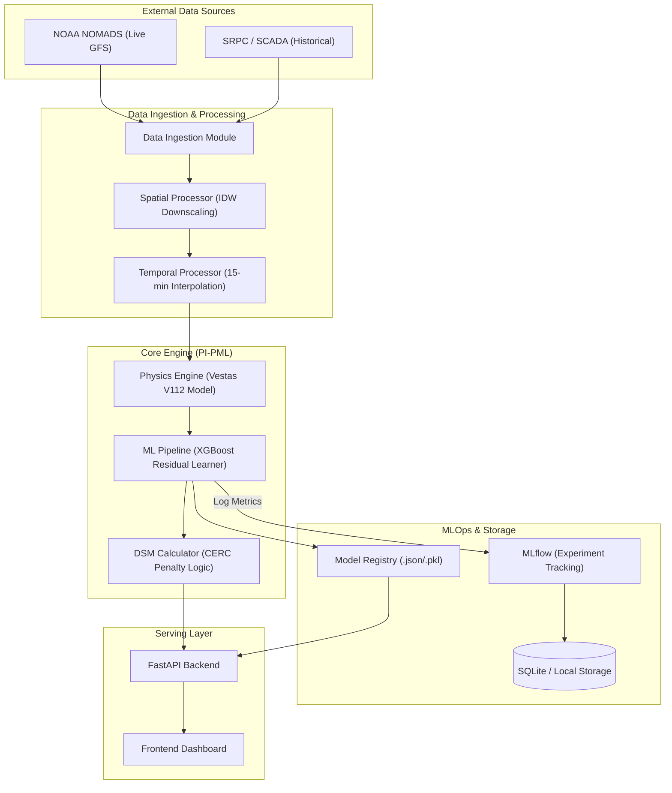

# Wind-DSM Architecture Blueprint

This document outlines the full system architecture for the **Wind Demand Side Management (DSM) Optimization** project. The system is designed to minimize financial penalties for wind power plant operators under Indian CERC regulations by combining physics-based modeling with residual machine learning.

## 1. High-Level System Architecture

The architecture follows a modular **PI-PML (Physics-Informed Predictive Machine Learning)** pattern, where a deterministic physics engine provides a baseline, and a stochastic ML model corrects the residuals.

---

## 2. Component Breakdown

### A. Data Layer
*   **Data Ingestion (`src/data_ingestion.py`)**: Asynchronous fetching of GFS weather data (Wind Speed, Direction, Temp) via NOAA APIs.
*   **Historical Ingestion (`src/historical_data_ingestion.py`)**: Processes SRPC block-wise data and historical weather CSVs.
*   **Processing (`src/spatial_processor.py`, `src/temporal_processor.py`)**: 
    *   **Spatial**: Inverse Distance Weighting (IDW) to interpolate grid-level weather to specific farm coordinates.
    *   **Temporal**: Linear/Cubic interpolation to convert hourly weather data into 96 blocks (15-min intervals) as per CERC requirement.

### B. Core Intelligence (The PI-PML Model)
1.  **Physics Engine (`src/physics_engine.py`)**: Uses `windpowerlib` to model the power curve of a 3MW Vestas V112 turbine. It generates a "Theoretical Power" baseline.
2.  **ML Pipeline (`src/ml_pipeline.py`)**: 
    *   **Residual Learning**: Instead of predicting power, it predicts the **error** of the physics engine.
    *   **Features**: Wind speed, Sin/Cos of wind direction, diurnal features, and historical error lags.
    *   **Algorithm**: XGBoost Regressor optimized for minimizing absolute error in the +/- 15% CERC "No-Penalty" zone.

### C. Financial & Regulatory Layer
*   **DSM Calculator (`src/dsm_calculator.py`)**: Implements the tiered penalty structure of Indian CERC regulations:
    *   0% - 10% Error: No Penalty.
    *   10% - 15% Error: ₹ 0.50 per unit.
    *   15% - 20% Error: ₹ 1.00 per unit.
    *   > 20% Error: Higher slabs.

---

## 3. Deployment Architecture

The system is containerized for portability across Windows (Development) and Linux (Production).

| Component | Technology | Role |
| :--- | :--- | :--- |
| **API** | FastAPI / Uvicorn | High-performance async endpoint for forecasts and retraining. |
| **Orchestration** | Airflow / Docker | Automates the 96-block daily forecasting schedule. |
| **ML Tracking** | MLflow | Versioning models and tracking performance across different parks. |
| **Containerization** | Docker Compose | Manages networking between the API, MLflow, and storage volumes. |
| **Persistence** | SQLite + Volumes | Stores historical weather and trained model weights. |

---

## 4. Operational Workflow (Sequence)

1.  **Trigger**: User uploads SCADA data or Airflow triggers a daily run.
2.  **Fetch**: Live GFS data is pulled for the next 24 hours.
3.  **Baseline**: Physics engine calculates the aerodynamic potential.
4.  **Correct**: XGBoost applies the "Residual Correction" based on trained patterns.
5.  **Finalize**: Data is formatted into the 96-block CSV template.
6.  **Report**: Savings are calculated by comparing the ML forecast vs. the Physics-only baseline.

---

## 5. Technology Stack

*   **Language**: Python 3.10+
*   **Physics Modeling**: `windpowerlib`
*   **Machine Learning**: `XGBoost`, `Scikit-learn`
*   **API Framework**: `FastAPI`
*   **Tracking**: `MLflow`
*   **Visualization**: `Matplotlib`, `Plotly`
*   **Infrastructure**: `Docker`, `GitHub Actions` (CI/CD)
