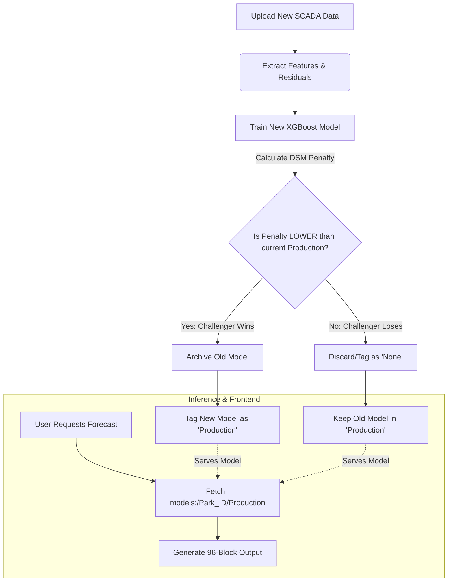

# Wind DSM & MLflow Architecture

The Wind DSM pipeline relies on MLflow's **Model Registry** to completely automate the lifecycle of the models. It abstracts away manual model versioning, allowing the frontend to seamlessly run inference without ever knowing which specific file to load.

## 1. How It Takes the Pre-Trained Model
When the frontend requests a forecast, it calls the `predict_with_xgb` function. 
Instead of hardcoding a path like `models/muppandal_v3.pkl`, the pipeline dynamically queries the MLflow SQLite database using a universal resource identifier (URI):
`model_uri = f"models:/Wind_DSM_Residual_{park_id}/Production"`

MLflow intercepts this request, checks its internal database for whichever version of the Muppandal model currently holds the `"Production"` tag, and seamlessly loads those exact weights into memory.

## 2. How Retraining Works
When a company uploads their custom `.csv` SCADA data, the pipeline triggers `train_xgboost`:
1. It aligns the actual SCADA timestamps with the historical weather data.
2. It calculates the **target residual** (the exact MW error the physics engine produced).
3. It trains a brand new XGBoost Regressor to predict those residuals.
4. It tests the model on a 7-day validation holdout set and calculates the exact `dsm_penalty_inr` (financial penalty).
5. It logs this new model to MLflow as a "Challenger" (with no stage assigned yet).

## 3. How We Switch Models (Champion vs. Challenger)
The pipeline never switches models blindly. It uses automated A/B financial testing:
- **Fetch Champion**: It asks MLflow for the current `"Production"` model and checks its recorded `dsm_penalty_inr`.
- **Combat**: It compares the new Challenger's penalty against the Champion's penalty.
- **Promotion**: If the new model results in *lower financial penalties* under the CERC regulations, the script executes:
  `client.transition_model_version_stage(model_name, latest_version, "Production", archive_existing_versions=True)`

This single line of code automatically demotes the old model to "Archived" and promotes the new model to "Production". The next time the frontend requests a forecast, it will instantly receive the newly upgraded model.
